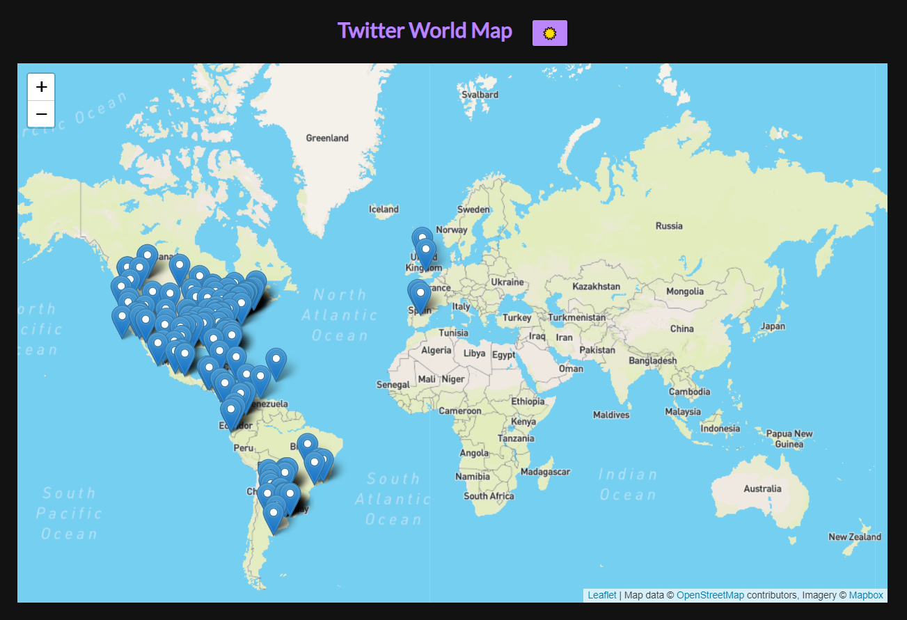
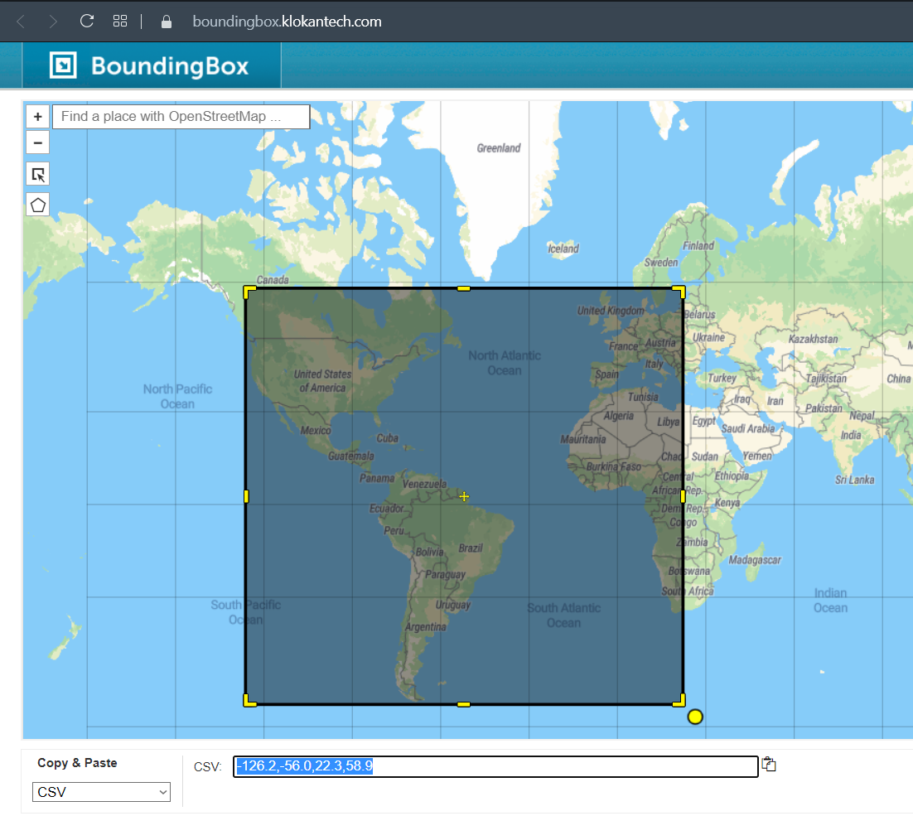
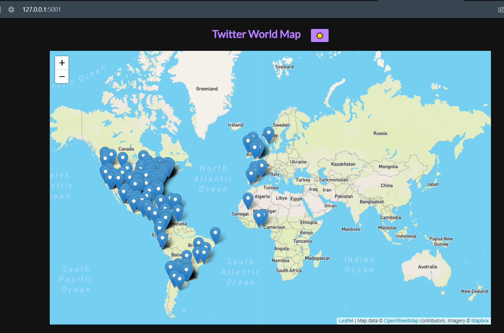
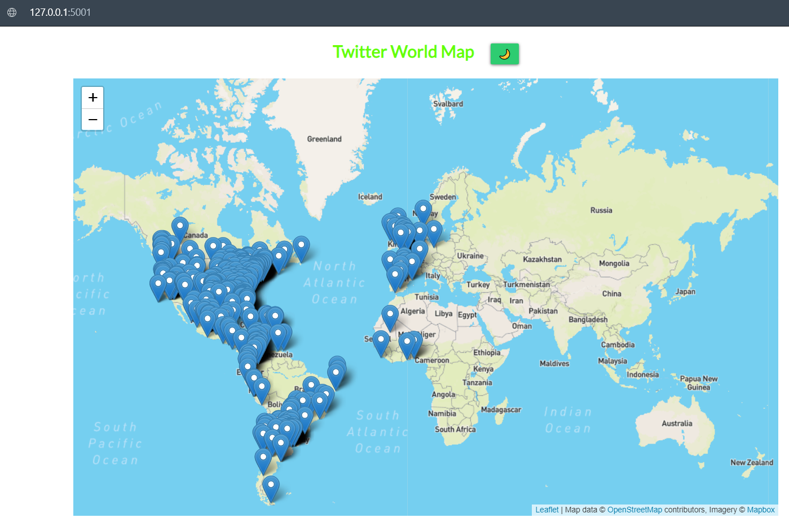
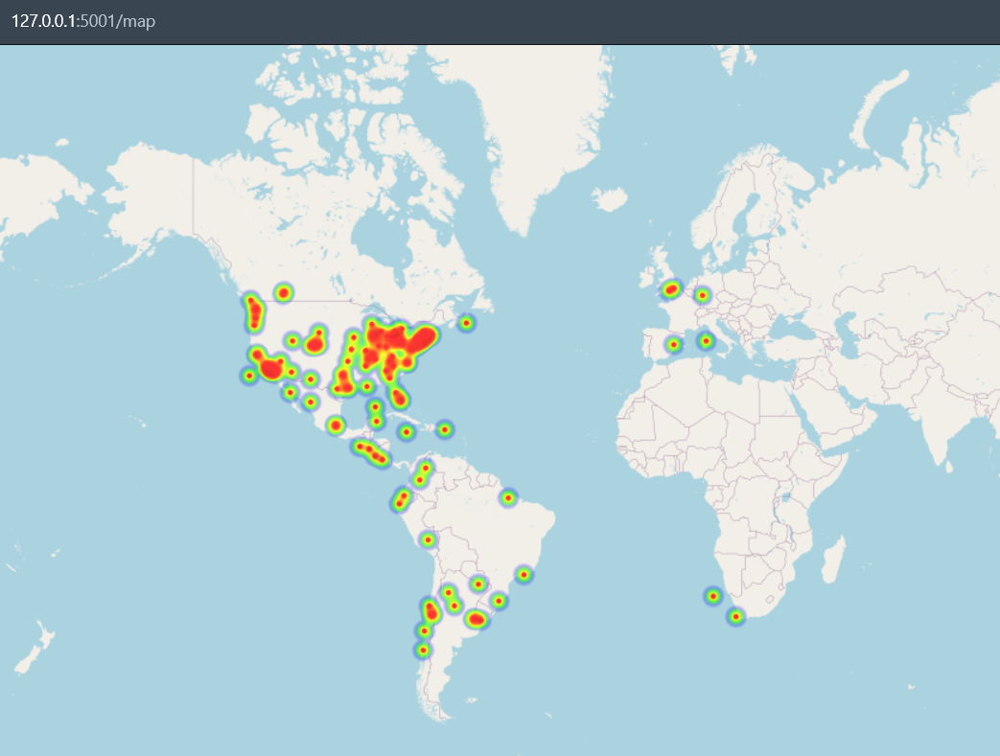

# 🐦 Streaming tweets with kafka

Demo of streaming tweets from twitter.



Features:

- [x] Geolocalization
- [x] Read tweets
- [x] Heatmap

## :floppy_disk: Installation

```bash
python -m venv env
```

```bash
. env/scripts/activate
```

```bash
python -m pip install --upgrade pip
```

```bash
pip install -r requirements.txt
```

## :wrench: Config

Create `.env` file. Check the example `.env.example`

Create your twitter app to get credentils:

```http
https://developer.twitter.com/en/docs/twitter-api/getting-started/getting-access-to-the-twitter-api
```

## 🏃‍♂️ Run

1. Run docker compose to initialize the kafka server.

```console
docker-compose -f "docker-compose.yaml" up -d
```

2. Config your search paramaters in `config.py`:

```python
TRACKS = ['#argentina','argentina','boca','river','ronaldo','messi','psg','barcelona','manchester']
LOCATION = [-126.2,-56.0,22.3,58.9]
LANGUAGES = ['en','es']
```

Check BoundingBox for setting `LOCATION` var

```http
https://boundingbox.klokantech.com
```

  

3. Run **new_topic.py** for create the kafka topic.
4. Run **producer.py** for read tweets and publish in kafka topic.
5. Run **frontend.py** for webserver flask
4. Go to *http://localhost:5001*

      
      

5. Go to *http://127.0.0.1:5001/topic/twitter* for see tweets in raw format.
6. Go to *http://127.0.0.1:5001/map* for see the heatmap

      
