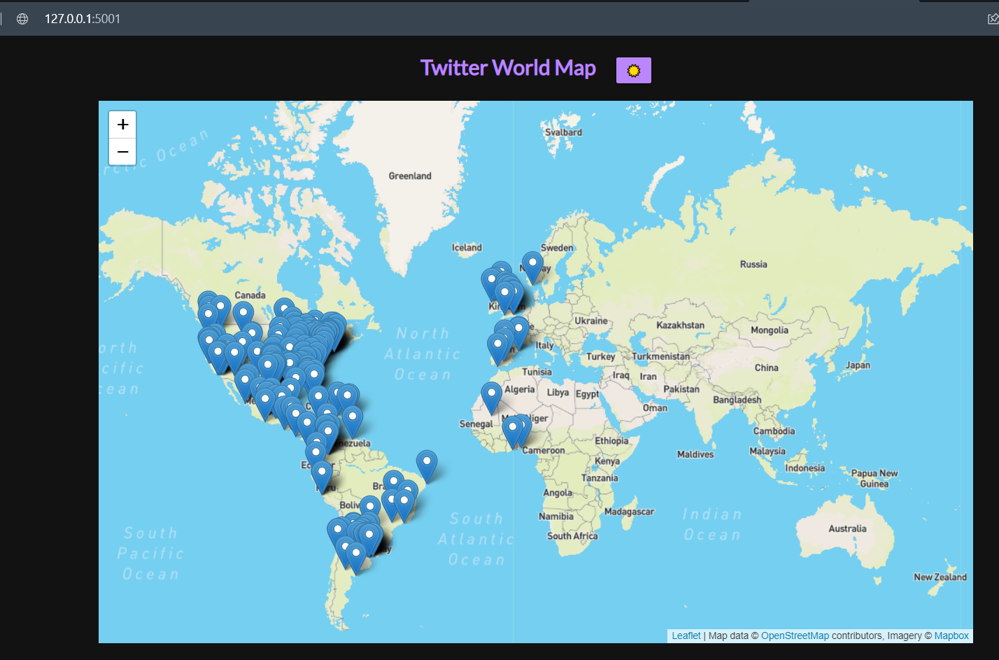
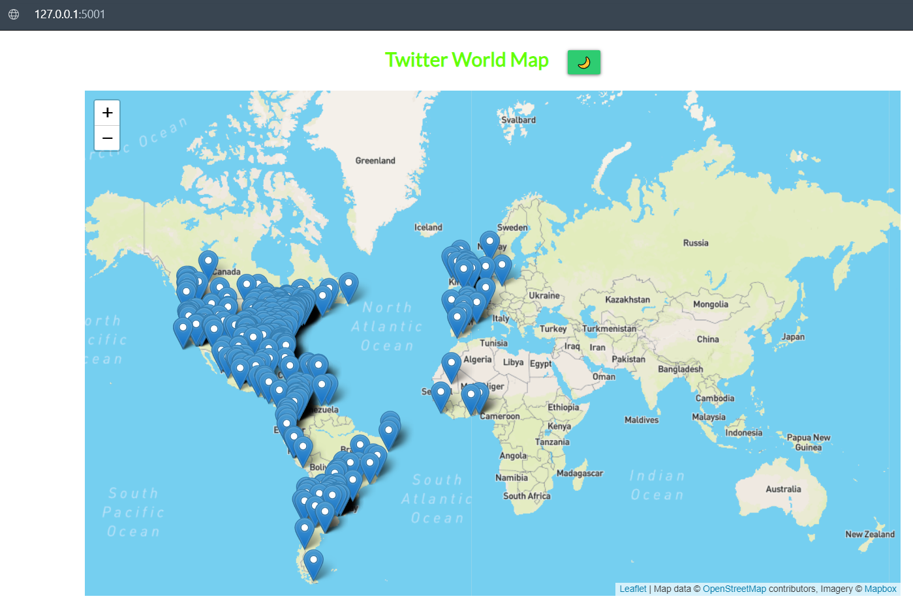
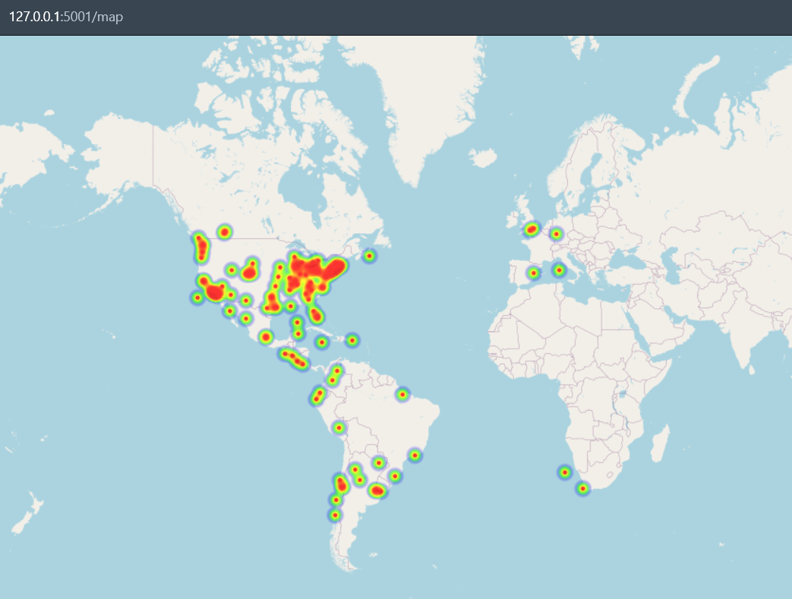

# Streaming twitter con kafka

Demo de streaming de tuits usando la api de Twitter y enviando los tuis a kafka para su posterior lectura y visualización en mapa.

  

&nbsp;

## Requerimientos

* Docker

```http
https://www.docker.com/get-started
```

* Acceso a la API de Twitter

Para generar la app developer y obtener las key

```http
https://developer.twitter.com/en/docs/twitter-api/getting-started/getting-access-to-the-twitter-api
```

* Acceso a la API de MapBox

Para obtener el token

```http
https://www.mapbox.com
```

* Git

```http
https://git-scm.com
```

* Instalar los requerimientos de python:
  
```console
pip install -r requirements.txt
```

&nbsp;

## Ejecución

&nbsp;

1. Clonar el repositorio

    ```console
    git clone https://github.com/ezeparziale/streaming-twitter-kafka.git .
    ```

    &nbsp;

2. Ejecutar el archivo docker-compose.yaml

    ```dockerfile
    docker-compose -f "docker-compose.yaml" up -d
    ```

    &nbsp;

3. Configurar los parametros

   * Configurar el archivo *config.py* seteando la variable **TOPIC_NAME** con el valor del topico que queremos crear

   ```python
   TOPIC_NAME = 'twitter'
   ```

   * Configurar los token de la api de twitter
  
   ```python
   API_KEY = 'INGRESAR_LA_API_KEY'
   API_SECRET_KEY = 'INGRESAR_LA_API_SECRET_KEY'
   ACCESS_TOKEN = 'INGRESAR_EL_ACCESS_TOKEN'
   ACCESS_TOKEN_SECRET = 'INGRESAR_EL_ACCESS_TOKEN_SECRET'
   ```

   * Configurar las variables de busqueda:
  
   ```python
   TRACKS = ['#argentina','argentina','boca','river','ronaldo','messi','psg','barcelona','manchesterd']
   LOCATION = [-126.2,-56.0,22.3,58.9]
   LANGUAGES = ['en','es']
   ```

   * Configurar el token de MapBox en el archivo *./static/leaf.js* en la variable **accessToken**
     

   &nbsp;

4. Ejecutar el archivo **new_topic.py** para crear el topico en kafka.
    &nbsp;
5. Ejecutar el archivo **producer.py** para correr el producer de kafka.  
    Este archivo va a conectarse a twitter y leer los tuits con los parametros establecidos y los va a disponibilizar en el topico.
    &nbsp;
6. Ejecutar el archivo **frontend.py** para levantar la web del mapa y asi poder visualizar el mapa.
    &nbsp;
7. Entrar con el explorador a *http://localhost:5001*

      
      

    &nbsp;

8. Entrar con el explorador a *http://127.0.0.1:5001/topic/twitter* para ver los distintos tweets en formato plano.

9. Entrar con el explorador a *http://127.0.0.1:5001/map* para ver el heat map

      

## Extras

* Para obtener las areas de las ubicaciones para poner en el parametro **locations** del *producer.py*
  
```http
https://boundingbox.klokantech.com
```

  

* Ejemplos posibles de mapas con **Leafletsjs**:
  
```http
https://leafletjs.com/examples.html
```
